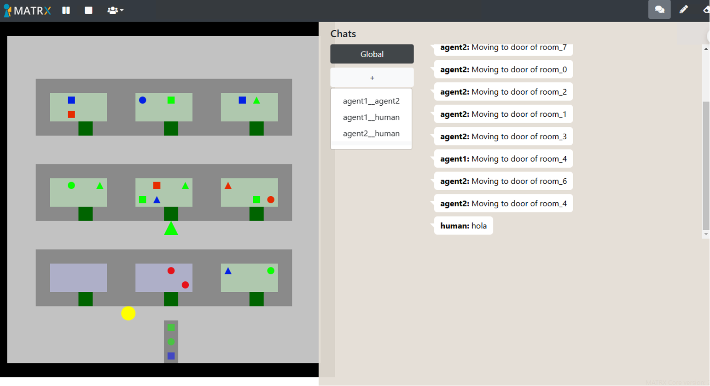

# Blocks World for Teams (BW4T)




Blocks World for Teams (**BW4T**) is a testbed EIS environment for team coordination. BW4T allows for games with human-human, agent-agent and human-agent teams of variable sizes. The goal is to jointly deliver a sequence of colored blocks in a particular order as fast as possible. A complicating factor is that the players cannot see each other. ([source](https://github.com/rsverhagen94/TU-Delft-Collaborative-AI-Trust)).

The environments works in all Operating Systems as long as it allows to run Python.

## Installation

1. Install python 3.10

For macOS, you can install Python 3.10 using Homebrew with the following command:
```bash
brew install python@3.10
```

For Windows, you can download the installer from the [official website](https://www.python.org/downloads/windows/).

For Ubuntu, you can install Python 3.10 using the following commands:
```bash
sudo apt update
sudo apt install python3.10
```

Test if the installation was successful by running the following command:
```bashx 
python --version 
```


2. Download the BW4T environment from [here](https://github.com/rsverhagen94/TU-Delft-Collaborative-AI-Trust) or clone the repository with the following command:
```bash
git clone https://github.com/rsverhagen94/TU-Delft-Collaborative-AI-Trust
```

3. Create a virtual environment with the following command:
```bash
python -m venv bw4tenv
```

or you also specify the exact python version with the following command:
```bash
/opt/homebrew/bin/python3.10 -m venv bw4tenv
```

Activate the virtual environment with the following command:
```bash
source bw4tenv/bin/activate
```

For Windows, you can activate the virtual environment with the following command:
```bash
bw4tenv\Scripts\activate
```

to deactivate the virtual environment, run the following command:
```bash
deactivate
```

4. Install the required packages with the following command:
```bash
pip install -r requirements.txt
```

Make sure to install `matrx==2.1.2` and replace the `state.py` file ("TU-Delft-Collaborative-AI-Trust_x/venv_py310/lib/python3.10/site-packages/matrx/agents/agent_utils/state.py") with the one provided in the repository ([this file](https://github.com/nimRobotics/hai-testbeds/blob/master/state.py)).

5. Run the BW4T environment with the following command:
```bash
python main.py
```

6. Open the browser and go to the following URL <http://localhost:3000/> to play the game. At the end of the game the logs are saved in `TU-Delft-Collaborative-AI-Trust_x/world_1` directory as timestamped csv files.

7. In-depth overview of the game can be found at [https://tracinsy.ewi.tudelft.nl/pubtrac/BW4T-Matrx-CollaborativeAI/wiki](https://tracinsy.ewi.tudelft.nl/pubtrac/BW4T-Matrx-CollaborativeAI/wiki). The game setup and algorithms can be changed by modifying the files
- `main.py`: set specific game settings
- `BW4TWorld.py` (TU-Delft-Collaborative-AI-Trust/bw4t/BW4TWorld.py): to change the appearance and the properties of the blocks
- `BW4THumanBrain.py` (TU-Delft-Collaborative-AI-Trust/bw4t/BW4THumanBrain.py): to change the human player's behavior
- `BW4TAgentBrain.py` (TU-Delft-Collaborative-AI-Trust/bw4t/BW4TAgentBrain.py): to change the agent's behavior