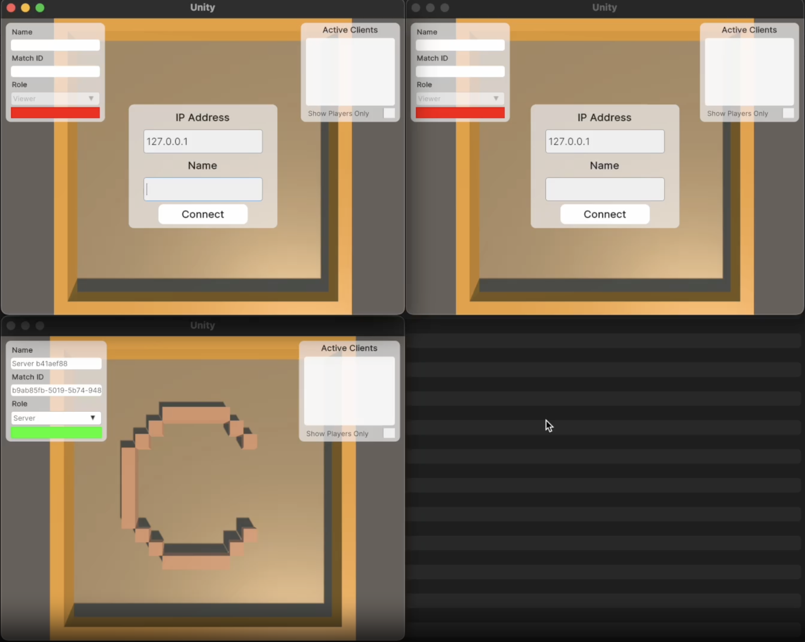

# CREW Human-AI Teaming testbed

CREW is a platform designed to facilitate Human-AI teaming research, engage collaborations from multiple scientific disciplines, with a strong emphasis on human involvement. It includes pre-built tasks for cognitive studies and Human-AI teaming with expandable potentials from our modular design. Following conventional cognitive neuroscience research, CREW also supports multimodal human physiological signal recording for behavior analysis. ([source](https://generalroboticslab.github.io/crew-docs/index.html)).

This platform supports Windows, macOS, and Linux. However, macOS prebuilt game environments does not work and will need to be rebuilt.

## Installation

Compreshensive installation guide can be found [https://generalroboticslab.github.io/crew-docs/getting_started/install.html](https://generalroboticslab.github.io/crew-docs/getting_started/install.html), make sure to follow them closely. Please reach out to Aakash if you face any issues.

<!-- 1. Install docker desktop from [here](https://www.docker.com/products/docker-desktop)
2.  -->