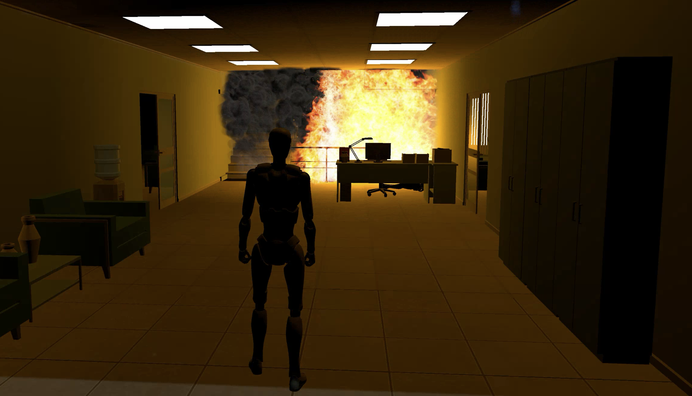
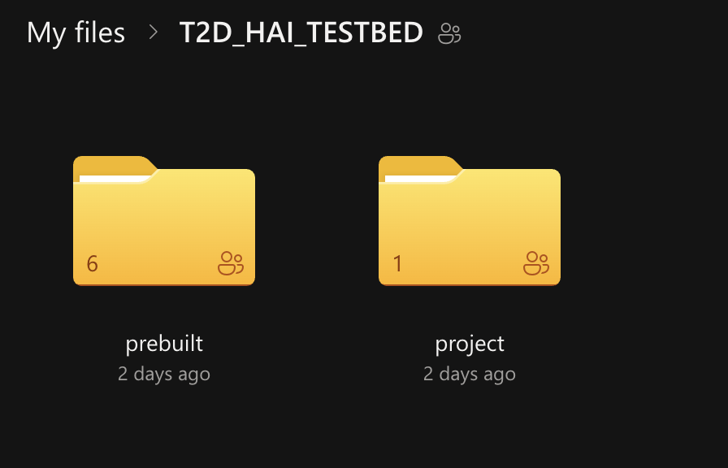
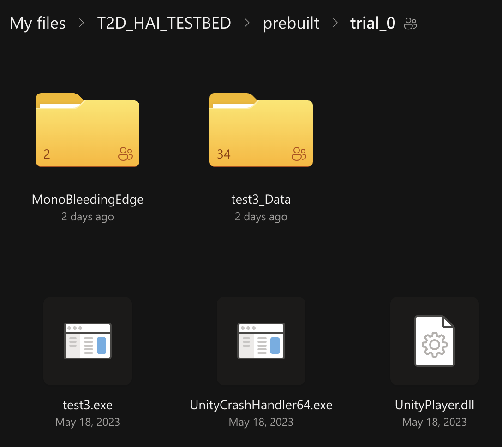
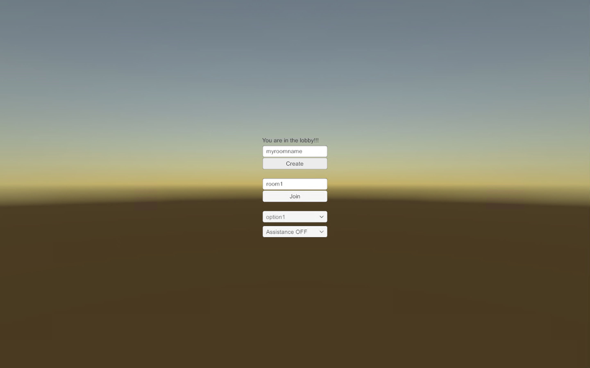
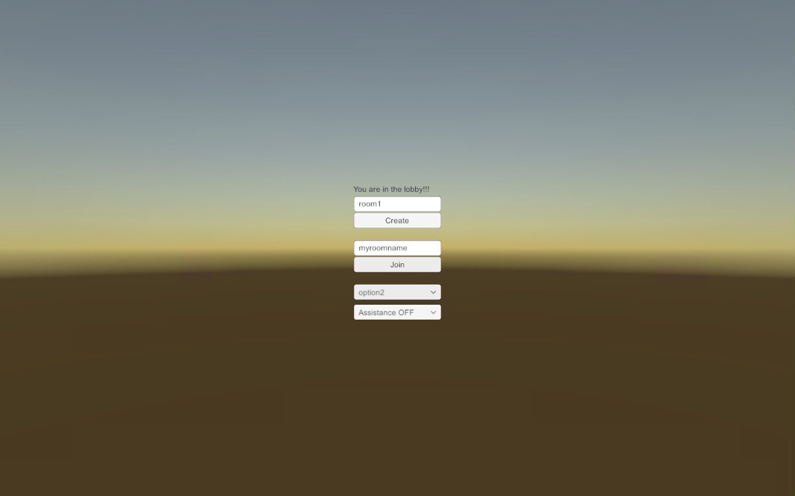
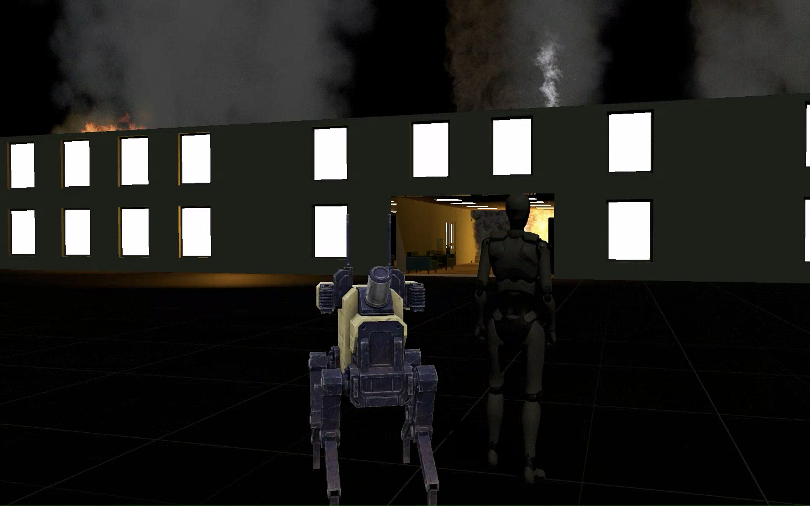

# T2D Human-AI robot teaming testbed

[PDF version](https://nimrobotics.github.io/hai-testbeds/docs/t2d.pdf)

The T2D Human-AI Robot Teaming testbed is a testbed for Human-AI Robot Teaming. The environment is designed in 3D with urban search and rescue in emergency environment. The robot can controlled with Wizard of Oz interface. ([source](https://dl.acm.org/doi/abs/10.1145/3610978.3640649)). The original tasked is aimed at three membered team (mission commander, robot navigator, safety officer) but can be played any number of agents.

This test environment only supports Windows out of the box. However, if needed it can be built for macOS and Linux.

## Installation

- No installation is required. The testbed is available for download from the [here](https://uwprod-my.sharepoint.com/:f:/g/personal/aakash2_wisc_edu/Evzo1Q_5RXlNsgCjv97ZiioBl3vu7bUQQs1nrRLx3dWdmQ?e=a9gB2Z) (Note: this link is only accessible with a UW-Madison email address).
- Prebuilt trials are availbe in `prebuilt` directory and can be run with double clicking `test3.exe` file withing a trial.
- Several trials are provided (each trial differs in the position of the victims).
- One agent will need to create the room by clicking `create` button and other agents can join the room by clicking `join` button (make sure the created and joined rooms have same names)
- There are two settings, the agent can be human (option 1) or robot (option 2). And the hazard level can be visible (Assistance ON) or invisible (Assistance OFF).
- The agent can be controlled with the keyboard (WASD keys or arrow keys).
- The game can be ended by closing the window (press windows key and right click on the window in the taskbar and click close window).
- Game logs are saved in the `LOGS` directory at the desktop.

## Task and Usage

The goal of the participants is to find the maximum victims in the virtual environment and tag their locations in a given time frame (3 minutes). The participants can use the keyboard to navigate their avatar in the environment. The team is told to work together to find the maximum number of victims in the environment. The team is interdependent since only safety officer can see the hazards and only the robot navigator has abillity to see the potential victims locations. The mission commander has the ability to tag the victims. The team needs to communicate and coordinate to find the maximum number of victims in the environment.

### Directory structure

The provided project [link](https://uwprod-my.sharepoint.com/:f:/g/personal/aakash2_wisc_edu/Evzo1Q_5RXlNsgCjv97ZiioBl3vu7bUQQs1nrRLx3dWdmQ?e=a9gB2Z) contains two folder (see Figure 2):

- `prebuilt` folder contains five prebuilt game trials [can be run by double clicking `test3.exe` file within the trial]
- `project` source code of the testbed that can be loaded in Unity to build the testbed for other platforms. [in most cases, the prebuilt trials should be sufficient and the source code is not needed]

### Running a game trials

The game trials are prebuilt and can be run by double clicking the `test3.exe` file within the trial. The trials are named as `trial_0` (practice trial), `trial_1`, `trial_2`, `trial_3`, `trial_4` and `trial_5`. Each trial has different positions of the victims in the environment. The game can be run by double clicking the `test3.exe` file within the trial (see Figure 3).

### Creating a room (server)

One agent will need to create the room by clicking the `create` button. The agent will be prompted to enter the room name (make sure to remember the room name). The agent can select the role (human/option1 or robot/option2) and the hazard level (visible for safety officer or invisible for mission commander) and click the `create` button. The agent will be prompted to enter the room name (make sure to remember the room name and keep it unique).

### Joining a room (client)

Other agents can join the room by clicking the `join` button. The agent will be prompted to enter the room name (make sure to enter the correct room name). The agent can select the role (human/option1 or robot/option2) and the hazard level (visible for safety officer or invisible for mission commander) and click the `join` button. 

### Playing the game

The agent can control the avatar with the keyboard (WASD keys or arrow keys).

